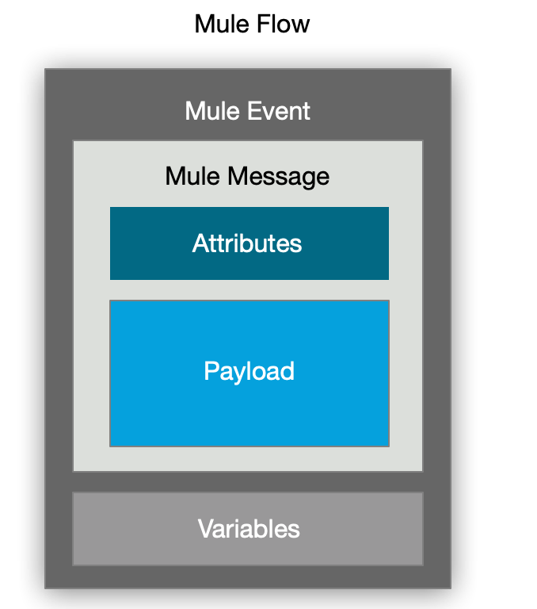

Mule 4 works on a simplified Mule message model in which each Mule event has a message and associated variables.

A Mule message includes:
- Request/Response payload
- Attributes 
- Variables
    - which hold information such as values for any operations, auxiliary values etc.



Client -- request --> Demo API 

## API
An API is a software intermediary that allows two applications to talk to each other.

Every API has it's request to any arbitory server and response from the server.

## API Request
Request is always sent to any server which provide some services through API's.


This request consists of :
- **Protocol** 
Any request has to go through any protocol, that could be RCP/http/websocket/etc. We will use http for our blog.
- **Operation/Method**
API always understand the action to be perform using operation. In http these operations called methods, example GET/DELETE/POST/PUT.
- **Resource**
The request need to provide a resource which allows API to understand what kind of obect, user wants to perform an operation.

> Note: We wil use http protocol for all the practical so you need to understand http protocol.

### Http protocol
Http protocol enable communication two software in text format. However, http is composed of method, resource, headers, and http status codes.

|Name|description|
|-----|-------------------|
|Method|GET/POST/DELETE/PUT|
|Resource| A resource name followed by slash ```/```, exampel ```/health```|
|Headers| Some extra information in key/value form ```Accept: application/json```
|Status code| Every request has a http response code which allows to identify any client for failure or success request. This is a numeric value. exmaple ```200/300/500```|
|Body| Some of the request/resonse has body which define the information/payload which we want to exachange with the server|

### HTTP Request
#### Logs
Below are the logs to demostrate the protocol, method, resource, headers and http status code.
```sh
curl -v http://localhost:8081/demo-api/health
> GET /demo-api/health HTTP/1.1
> Host: localhost:8081
> User-Agent: curl/7.64.0
> Accept: */*
>
< HTTP/1.1 200
< Content-Type: application/json; charset=UTF-8
< Content-Length: 36
< Date: Tue, 04 Feb 2020 09:03:33 GMT
<
{ [36 bytes data]
{
  "status": "API is working ok!"
}

```
In above logs greater than arrow **\>** describe the outgoing request and less than arrow **\<**
 describe the incoming response.

> \> GET /demo-api/health HTTP/1.1
Above line has ```GET``` method, ```/demo-api/health``` resource, and ```HTTP/1.1``` protocol with version number.

> \> Host: localhost:8081
Above line has header ```Host``` with value which is key/pair. Key is ```Host```, Value ```localhost:8081```.

> \> User-Agent: curl/7.64.0
Another example of header, Key ```User-Agent``` and value  ```curl/7.64.0```


> \< HTTP/1.1 200
Above numeric value define the http status, which allows a client to check whether the request was successful or failed.

>\< Content-Type: application/json; charset=UTF-8
Above is response header, again key ```Content-Type``` and value ```application/json; charset=UTF-8```

```json
{
  "status": "API is working ok!"
}
```
Above is the body of the response from Demo api.

Failure http request

```
> GET /demo-api/health1 HTTP/1.1
> Host: localhost:8081
> User-Agent: curl/7.64.0
> Accept: */*
>
< HTTP/1.1 404 Not Found
< Content-Type: text/plain
< Date: Tue, 04 Feb 2020 09:22:41 GMT
< Transfer-Encoding: chunked
<
No listener for endpoint: /demo-api/health1
* Connection #0 to host localhost left intact
```
>\< HTTP/1.1 404 Not Found
In above logs, if you will check http status code ```404`` which means server responed with an error response.


### Http Status Codes

|Code|Description|Other|
|---|-----------|-------|
|200/201/204| Success||
|300|Authentication/access failuire|
|400/401/403/404| Failed| Request failed because of client send an incorrect details|
|500/501/503| Failed | Request failed because of server had some issues to process it. |

#### 40x
Issue with the request sent by the client.

#### 50x
Issue is with server.

#### 30x
Issue with authentication.