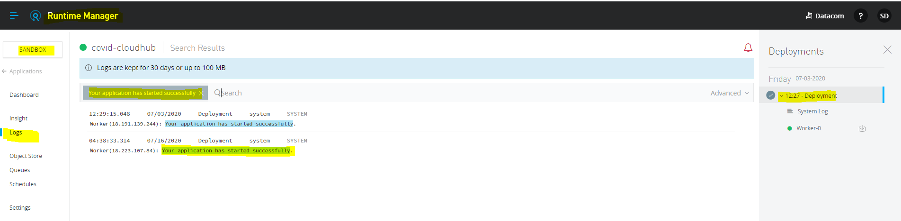

- [Mule4 cheatsheet](#mule4-cheatsheet)
- [Mule projects](#mule-projects)
  - [Object Store](./projects/object-store/Object-Store.md)
  - [Dataweave-2.0 Examples](./projects/Dataweave-2.0/)
  - [VM Queue](./projects/vm-cluster/Readme.md)
  - [Claims API - Health Design Pattern](projects/api-led-implementation/README.md)
  - [Object Store - CloudHub + OnPrim](projects/object-store/Object-Store.md)
  - [RAML Components Learning](projects/RAML/README.md)
  - [Mulesoft VM Queue](projects/vm-cluster/Readme.md)
  - [Wiremock Mock Downstream APIs](projects/wiremock-stubbing/README.md)
- [Cloudhub](#Cloudhub)
- [TLS with Mule4](#tls-with-mule4)
  * [Keytool](#keytool)
    + [Generate mule.jks and mule-trust.jks](#generate-mulejks-and-mule-trustjks)
    + [Restrict server-crt to dhaks.localhost.nip.io dns name and ip address 127.0.0.1](#restrict-server-crt-to-dhakslocalhostnipio-dns-name-and-ip-address-127001)
  * [Curl](#curl)
  * [Debug java ssl](#debug-java-ssl)
  * [sed, a stream editor](#sed--a-stream-editor)
  * [Example1:  Tls v1.2 enabled in Mule4](#example1---tls-v12-enabled-in-mule4)
  * [Example2: Add logger in Mule4 code](#example2--add-logger-in-mule4-code)
    + [Before: File health-implementation.xml](#before--file-health-implementationxml)
    + [Run below command:](#run-below-command-)
    + [After: File health-implementation.xml](#after--file-health-implementationxml)
  * [Example3: Enable debug for database extension](#example3--enable-debug-for-database-extension)
  * [Custom Security Policy](#custom-security-policy)
    + [Create a project using Maven archtype](#create-a-project-using-maven-archtype)
  * [Dataweave 2.0](#dataweave-20)
    + [Define New Class object](#define-new-class-object)

# Mule4 cheatsheet
This repository for users to help themselves for Mule4 projects.

# Mule projects
Here you can find the projects which has an example API running with concepts in details.

|Project|Description|Links|
|-|-|-|
|Design API with Workbench| Workbench an Atom editor plugin allows us to design RAML specification |Please click [here](https://github.com/choudharydhaka/mule4-cheatsheet/tree/master/projects/health-check/demo-api) for a detailed step by step guidelines to design, develop and run an API.|
|How to use secure properties| Mule allows to encrypt any secrets|Please click [here](https://github.com/choudharydhaka/mule4-cheatsheet/tree/master/projects/secure-property)
|Claims API| Demostrate how to use API led connectivty approach and implement health design pattern| Please Click [here](projects/api-led-implementation/README.md)
|CLaims API| Demostrate how to use API led connectivty approach and implement health design pattern| Please Click [here](projects/api-led-implementation/README.md)
|Dataweave-2.0 Examples| Usefull tips and tricks to learn Dataweave 2.0|Click [here](projects/Dataweave-2.0)|
|Object Store| Anypoint Object Store behaviour details on both OnPrim and CloudHub| Click [here](projects/object-store/Object-Store.md)|
|Raml Components|Allows you to utilize RAML components|Click [here](projects/RAML/README.md)
|MuleSoft VM Queue| Demostration to use VM Queue with different use cases|Click [here](projects/vm-cluster/Readme.md)
|Wiremock - Mocking APIs|Wiremock is a very lightweight tool based on java, which allows you to mock the downstream REST/SOAP Services both static and dynamically|Click [here](projects/wiremock-stubbing/README.md)|
# Cloudhub
## How to find IP address of a cloudhub worker
Cloudhub provide logging facility, where it will log an entry for the ipaddress.
Please search the following text 
``` Your application has started successfully```



# TLS with Mule4
TLS allows to secure API's with Mule4. 
## Keytool
Keytool is a java based tool which help to generate, list, import, export etc. TLS certificates to/from java keystore. Mule support both ``` JKS``` and ``` PKCS12``` keystores,however here we gonna generate JKS keystore & trust store using keytool.
### Generate mule.jks and mule-trust.jks
```sh
## move to tmp directory
cd /tmp/keystore/jks/
## Generate mule.jks keystore with self signed certificate using alias server-crt
keytool -genkeypair -dname "CN=*.localhost, OU=Integartion, O=dhaka, L=New Delhi, ST=New Delhi, C=IN"  -keypass password  -storepass changeit -validity 9999 -keystore mule.jks -alias server-crt 

## Expoert public certificate of alias server-crt
keytool -export -keystore mule.jks -storepass changeit -alias server-crt -file server-pub.cer
## Create trust mule keystore
keytool -import -file server-pub.cer  -alias server-crt -keystore mule-trust.jks -storepass changeit -noprompt
```

### Restrict server-crt to dhaks.localhost.nip.io dns name and ip address 127.0.0.1
```
keytool -genkeypair -dname "CN=*.localhost, OU=Integartion, O=dhaka, L=New Delhi, ST=New Delhi, C=IN"  -keypass password  -storepass changeit -validity 9999 -keystore mule.jks -alias server-crt -ext SAN=DNS:dhaks.localhost.nip.io,IP:127.0.0.1

## TLS 
```yaml


 local:
    host: "localhost"
    port: "8081"
    basepath: "demo-api"    
    timezone: "NZ"
    tls-port: "8443"
    tls-keystore: "/tmp/keystore/jks/mule.jks"
    tls-keystore-password: "changeit"
    tls-server-cert: "server-crt"
    tls-sever-cert-password: "changeit"
    tls-trust-keystore: "/tmp/keystore/jks/mule-trust.jks"
    tls-trust-keystore-password: "changeit" 
    
 ```


## Curl

This will help team to copy and paste headers to use curl.
```sh
curl -v
  -H 'x-api-key: bba3ea5180432a871837726488934592' \
  -H 'x-api-secret: 1837726488934592bba3ea5180432a87' \
   https://localhost:8082/demo-api/v1/health
```  

## Debug java ssl
Sometimes it's helpful to check ssl communication to debug the issues, Mule4 allows to pass on properties to jvm using ``` -M-D<PropertyName>=<PropertyValue>```.
```
-M-Djavax.net.debug=ssl
```
## Network testing
```sh
nc -zv -w timeout host port
```
Example:
```sh
$ nc -zv -w 10 sahasrar.co.nz 80
Ncat: Version 7.50 ( https://nmap.org/ncat )
Ncat: Connected to 172.67.135.2:80.
```
If you are using a Proxy:
```sh
nc -x <proxy>:<port> -X connect -zv -w 10 host port
```
Example:
```sh
$ nc -x 127.0.0.1:8080 -X connect  -zv -w 10 sahasrar.co.nz 443
```
nc: Proxy error: "HTTP/1.1 200 Connection established"

### Telnet
In case the nc command is not available you could use the telnet command. If you see an output similar to the one below it means there is connectivity.
#### Syntax:
```sh
telnet <host> <port>
```
Example:
```sh
$ telnet sahasrar.co.nz 80
Trying 104.21.6.159...
Connected to sahasrar.co.nz.
```
If the connection is not successful you could see an error similar to this:

```sh
$ telnet localhost 1234
Trying 127.0.0.1...
telnet: connect to address 127.0.0.1: Connection refused
telnet: Unable to connect to remote host
```
Needless to say, the nc command is more convenient for testing connectivity.
 
### Ping
One of the most common tools for testing connectivity is the ping command. Unfortunately it has some limitations mentioned below that limit its usefulness.

#### Syntax:
```sh
ping <host>
```
Example:
```sh
$ ping sahasrar.co.nz
PING sahasrar.co.nz (104.21.6.159) 56(84) bytes of data.
64 bytes from 104.21.6.159 (104.21.6.159): icmp_seq=1 ttl=57 time=31.2 ms
```


## sed, a stream editor
Sed is a linux command to help to subtitute values of any file. I'm using to comment out enableProtocols to enforce TLSv1.2 in tls-default.conf file in Mule4 runtime. please click [here](https://www.gnu.org/software/sed/manual/sed.html) for official documents.

```
sed SCRIPT INPUTFILE
sed 's/hello/world/' input.txt > output.txt
```
For example, to replace all occurrences of ‘hello’ to ‘world’ in the file input.txt:

## Example1:  Tls v1.2 enabled in Mule4
```sh
sed -i 's/enabledProtocols/#enabledProtocols/' tls-default.conf |grep enabledProtocols
echo "########################## Change TASK 00001 enforce TLSv1.2 TLS support #######################################" >> tls-default.conf && \
echo "enabledProtocols=TLSv1.2" >> tls-default.conf
```
## Example2: Add logger in Mule4 code
We will add custom logger to the code in the API implementation file using sed tool.

### Before: File health-implementation.xml
```xml
<flow-ref doc:name="Call Downstream Inbound Success Log subFlow" name="downstream-inbound-success-log-sub-flow" doc:id="d6bf12b6-a4e2-4e77-9694-61e577123456" />

					<choice doc:name="Choice" doc:id="123456-a4e2-4e77-9694-61e577123456" >

```
We are using **doc:id** "d6bf12b6-a4e2-4e77-9694-61e577123456" to uniquily identify the element in the file. Below command allow to add ```<logger level="INFO" doc:name="DHAKA" doc:id="DHAKA" message="#[output application/json --- SUCCESS: payload]" />``` to the file ```health-implementation.xml``` to print payload in json format after calling **downstream-inbound-success-log-sub-flow** subflow.

### Run below command:

```sh 
# $MULE_HOME an environement variable pointing to Mule4 runtime home.
cd $MULE_HOME/apps/demo-api/

sed 's/d6bf12b6-a4e2-4e77-9694-61e577123456\" >/DHAKA1\" > <logger level=\"INFO\" doc:name=\"DHAKA\" doc:id=\"DHAKA\" message=\"#\[output application/json \-\-\- SUCCESS: payload\]\"\/>/ health-implementation.xml
```
### After: File health-implementation.xml

```xml
<flow-ref doc:name="Call Downstream Inbound Success Log subFlow" name="downstream-inbound-success-log-sub-flow" doc:id="DHAKA1" />
        <logger level="INFO" doc:name="DHAKA" doc:id="DHAKA" message="#[output application/json --- SUCCESS: payload]" />
					<choice doc:name="Choice" doc:id="431c44ef-36c5-47b0-956d-810abccd8ad5" >

```


## Example3: Enable debug for database extension
```sh
# $MULE_HOME an environement variable pointing to Mule4 runtime home.
cd $MULE_HOME/apps/demo-api/

sed 's/<\/Loggers/<AsyncLogger name=\"org.mule.extension.db\" level=\"DEBUG\" \/> <\/Loggers/' log4j2.xml

```

## Custom Security Policy
Mule4 allows to apply security policies using Anypoint API Manager, Mule4 runtime has an embeded API gateway component to intercept the requests/responses and enforces the policies on them. Sometimes we need to create some custom policies to meet an out of the box business requirement. 

### Create a project using Maven archtype
MuleSoft provides an Maven compatible to generate template artifects to starts with. You must have some of the key values before hands to pass on to ```mvn`` command as arguments.


```sh
mvn -Parchetype-repository archetype:generate \
-DarchetypeGroupId=org.mule.tools \
-DarchetypeArtifactId=api-gateway-custom-policy-archetype \
-DarchetypeVersion=1.1.0 \
-DgroupId=${orgId} \
-DartifactId=${policyName} \
-Dversion=1.0.0-SNAPSHOT \
-Dpackage=mule-policy

```
If you might have noticed couple of variables( ```$orgId``` and ```${policyName}``` ) you will need to provide when you will issue the command.

|Argument  | Description|
|-----|---------|
|orgId| This is an organization Id provided by MuleSoft against your created organisation, Please check Access Management -> Organization -> Click on the org Name -> Organization Id, example: 123456789-2345-6789-12-3456789-887777 |
|policyName| Name of the policy, exmple gw-http-custom-policy|


```
mvn -Parchetype-repository archetype:generate -DarchetypeGroupId=org.mule.tools -DarchetypeArtifactId=api-gateway-custom-policy-archetype -DarchetypeVersion=1.1.0 -DgroupId=123456789-2345-6789-12-3456789-887777 -DartifactId=gw-http-custom-policy -Dversion=1.0.0 -Dpackage=mule-policy
```


You can find above example [here](https://docs.mulesoft.com/api-manager/2.x/custom-policy-getting-started) on MuleSoft website. 


once the API is up and running.

 You have applied the policy

## Dataweave 2.0


### Define New Class object 
```
payload.requestTimestamp as DateTime { class : "java.sql.Date"}
```


# Execute Java Method from Dataweave
```
<set-variable value='#["(objectGUID=" ++ (java!operator::Convertor::getSearchFilterFormattedGUID(vars.searchGuid)) ++ ")"]' doc:name="Set Guid Criteria" doc:id="5c1a95c5-fe2d-4a6d-b9c6-62bfb77cbcc0" variableName="criteria"/>
		 ("guid": java!operator::Convertor::convertToDashedString(payload.objectGUID )) if (payload.objectGUID !=null ),
write( java!operator::Convertor::getPass('&quot;' ++ vars.originalRequestData.password ++ '&quot;'),&quot;application/java&quot;)

	 ("guid": java!operator::Convertor::convertToDashedString(vars.adSearchResponse.objectGUID )) if (vars.adSearchResponse.objectGUID !=null ),
```

```java
package operator;

import java.util.UUID;

/**
 * Convertor class to convert objectGUID byte array to a human readable string.
 * code taken from Mulesoft Article : https://help.mulesoft.com/s/article/Ldap-ObjectGUID-field-retrieval
 * 
 * @author HaryoT
 *
 */
 
public class Convertor {
	
	/**
	 * Convert to human readable string.
	 * @param objectGUID byte array returned by AD 
	 * @return example: 91de7a48-7785-4ede-8d12-873e9c09deb0
	 */
	public static String convertToDashedString(byte[] objectGUID) {
		if(objectGUID == null || objectGUID.length==0) return "false";
		UUID uuid = bytesToUUID(objectGUID);
		return uuid.toString();
	}
	
	/**
     * Converts a byte array into an {@link UUID} object.
     * <p/>
     * Microsoft stores GUIDs in a binary format that differs from the RFC standard of UUIDs (RFC #4122). (See details
     * at http://en.wikipedia.org/wiki/Globally_unique_identifier) This function takes a byte array read from Active
     * Directory and correctly decodes it as a {@link UUID} object.
     *
     * @param bytes Byte array received as en entry attribute from Active Directory.
     * @return {@link UUID} object created from the byte array, or null in case the passed array is not exactly 16 bytes long.
     */
	private static UUID bytesToUUID(byte[] bytes) {
        if (bytes != null && bytes.length == 16) {
            long msb = bytes[3] & 0xFF;
            msb = msb << 8 | (bytes[2] & 0xFF);
            msb = msb << 8 | (bytes[1] & 0xFF);
            msb = msb << 8 | (bytes[0] & 0xFF);

            msb = msb << 8 | (bytes[5] & 0xFF);
            msb = msb << 8 | (bytes[4] & 0xFF);

            msb = msb << 8 | (bytes[7] & 0xFF);
            msb = msb << 8 | (bytes[6] & 0xFF);

            long lsb = bytes[8] & 0xFF;
            lsb = lsb << 8 | (bytes[9] & 0xFF);
            lsb = lsb << 8 | (bytes[10] & 0xFF);
            lsb = lsb << 8 | (bytes[11] & 0xFF);
            lsb = lsb << 8 | (bytes[12] & 0xFF);
            lsb = lsb << 8 | (bytes[13] & 0xFF);
            lsb = lsb << 8 | (bytes[14] & 0xFF);
            lsb = lsb << 8 | (bytes[15] & 0xFF);

            return new UUID(msb, lsb);
        }
        return null;
    }
}

```

# Performance

## Enable Native Memrory Tracking 
Allows to understand the momery allocation for Runtime tunning.

```sh
# Pass below param as and argument
-XX:NativeMemoryTracking=summary
#get Java Process ID
$ jps -m
# 20552 MuleContainerBootstrap -M-Dmule.forceConsoleLog -M-Dmule.testingMode -M-XX:NativeMemoryTracking summary -M-XX:-UseBiasedLocking -M-Dfile.encoding UTF-8 -M-XX:+UseG1GC -M-XX:+UseStringDeduplication

# Get native and total memory reserved
$ jcmd 20552 VM.native_memory |grep -e "Native\|Total"
Native Memory Tracking:
Total: reserved=2608288KB, committed=1343532KB
-    Native Memory Tracking (reserved=4738KB, committed=4738KB)

$ jstack -l 20552 > /c/tmp/mydump.out
``` 
 
# 0.1 vCore in Anypoint Studio VM arguments
```sh
-XX:NativeMemoryTracking=summary 
-Xmx490m 
-Xms490m 
-XX:ReservedCodeCacheSize=64m 
-XX:MaxDirectMemorySize=32m 
-XX:MaxMetaspaceSize=256m   
```

# 0.2 vCore in Anypoint Studio VM arguments
```sh
-XX:NativeMemoryTracking=summary 
-Xmx960m 
-Xms960m 
-XX:ReservedCodeCacheSize=240m 
-XX:MaxDirectMemorySize=128m 
-XX:MaxMetaspaceSize=256m
```
# 1 vCore in Anypoint Studio VM arguments
```sh
-XX:NativeMemoryTracking=summary 
-Xmx1500m
-Xms1000m
-XX:ReservedCodeCacheSize=240m 
-XX:MaxDirectMemorySize=512m 
-XX:MaxMetaspaceSize=256m
 ```

|Worker Size|	DirectMemorySize, MiB|Heap|Non Heap|
|-|-|-|-|
|0.1 vCore|	32| 490|490
|0.2 vCore|	128|960|960
|1vCore|512|1.5/2 GB|1.5/2 GB

> The metaspace limit for apps deployed to CloudHub is currently 256 MB, regardless of the worker size. The initial metaspace size is 128 MB; metaspace garbage collection begins after the metaspace reaches that threshold.

## References
- https://help.mulesoft.com/s/article/Application-Deployed-to-a-Fractional-vCore-Worker-in-CloudHub-Throws-java-lang-OutOfMemoryError-Direct-buffer-memory

## Transform module in the application
Module allocates 1.5 MiB of a memory buffer from Direct Memory native allocation. You may need to think about the intense requests leads to a restart where Heap Memory is not an issue, its Native memory allocation.

## Tools:
- jps : Get java process
- jCMD 
- visualvm

# Logging
Logging is very important, it utilize CPU consumption and one log file has a certain size.
## Use Case 1
A payload with size 15 MB is called, Now if any one print the entire payload 10 times, you may endup creating an API call into 10 files, which makes hard to track any issue if occured, Also the unnecessary computation.

Cloudhub log file size: 10 mb
soap msg size -> 10mb
logger * 10 => produce logs files 10, and cpu overhead to print the payload, challeniging to troupleshoot the issue.

# Capacity Planning
Capacity planning has mainly two criteria -
- Payload size
- processing intensity
Also, think about the fractional vCores, how does it work with CloudHub.
> 0.2*5 -> don't consume cpu -> fractional vCores -> doesn't utilize cpu.

- Small payload -> processing takes very little time -> message rate is intesnse -> 0.2x5 is better option -> if you don't consumes the cpu, you would have more processing threads

- If large payload with lower rate -> better to use 1 vcore worker

## OnPrim - Application Ready OnPrim
Resource Allocation 
-	linux -> process and thread both are equal
-	CPU Core
-	Mem


## References
- https://help.mulesoft.com/s/article/Network-connectivity-testing
